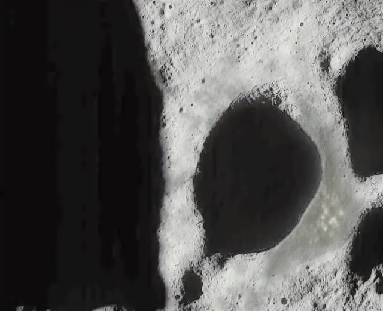
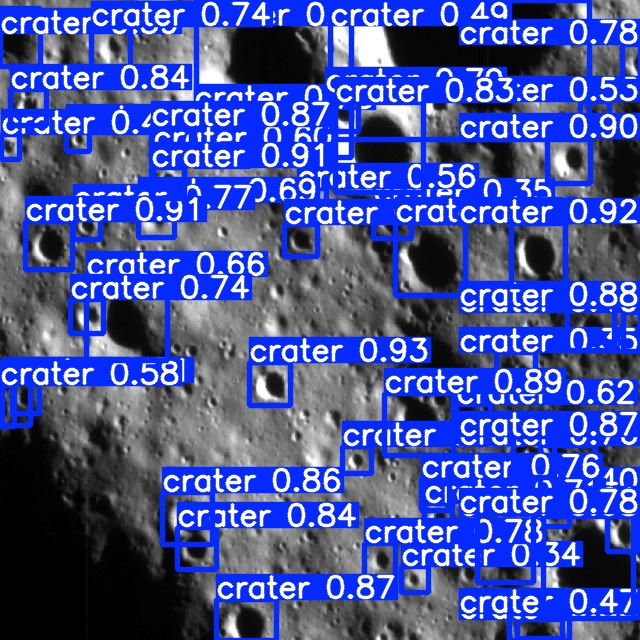

# PSR-Lunar-Enhancement

 An ML model framework to enhance the analysis of Lunar PSRs, improving image accuracy and insights for lunar exploration.

``````
Created by team: Entropy
``````

 ## Running the retinexformer model to enhance images

To run the project for enhancing the lunar images using retinexformer model which is taken from [here](https://github.com/caiyuanhao1998/retinexformer):

- Clone the repository using `git clone https://github.com/Optimus-Labs/PSR-Lunar-Enhancement`

- Create a new conda/python(venv) environment and install the necessary dependencies:

  ``````shell
  conda install pytorch=1.11 torchvision cudatoolkit=11.3 -c pytorch
  
  pip install matplotlib scikit-learn scikit-image opencv-python yacs joblib natsort h5py tqdm tensorboard
  
  pip install einops gdown addict future lmdb numpy pyyaml requests scipy yapf lpips
  ``````

- Create the dataset consisting of the images to be enhanced for the project we used the given [dataset](https://universe.roboflow.com/titaniumsv5/chandrayaan-2-ohrc-lunar-crater-dataset/dataset/4).

- Run the retinexformer image enhancement using:

  ``````shell
  python3 retinexformer.py
  ``````

The lunar crater image can be shown as:


Lunar Crater Enhanced Image using Retinexformer:



## Craters detection using YOLO (You Only Look Once)

For crater detection in enhanced images we decided to fine-tune over the top of YOLOv8 which can be accessed from `YOLOv8.ipynb`

The output of crater detected on enhanced image using YOLOv8 can be seen as:


